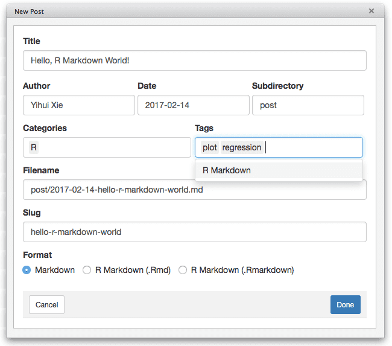

# blogdown

The goal of the **blogdown** R package is to provide a powerful and customizable website output format for R Markdown. You can use the **blogdown** package to build bespoke websites from the comfort of the RStudio IDE, and build webpage content using dynamic R Markdown documents featuring:

+ R code (or other programming languages that knitr supports),

+ automatically rendered output such as graphics, tables, analysis results, and HTML widgets, and

+ technical writing elements such as citations, footnotes, and LaTeX math, enabled by the bookdown package.

By default, blogdown uses Hugo (see Chapter \@ref(hugo)), a popular open-source static website generator, which provides a fast and flexible way to build your site content to be shared online. Other website generators like Jekyll and Hexo are also supported, as detailed in Chapter \@ref(other-generators).

A useful feature of blogdown sites, compared to other R Markdown-based websites, is that you may organize your website content (including R Markdown files) within subdirectories. This makes blogdown a good solution not just for blogging or sites about R — it can also be used to create general-purpose websites to communicate about data science, statistics, data visualization, programming, or education.

In this chapter, we'll share some unique features of the **blogdown** package like RStudio addins, a Hugo versioning system, and checking functions to help you diagnose and prevent issues with your site.

## RStudio IDE

There are a few essential RStudio addins\index{RStudio addins} to make it easy to edit and preview your website, and you can find them in the menu "Addins" on the RStudio toolbar:

- "Serve Site": This addin calls `blogdown::serve_site()` to continuously serve your website locally using the LiveReload technology, so you can live preview the website. You can continue to edit material for your site while you are previewing it.

- "New Post": This addin provides a dialog box for you to enter the metadata of your blog post, including the title, author, date, and so on. See Figure \@ref(fig:new-post) for an example. This addin actually calls the function `blogdown::new_post()` under the hood, but does a few things automatically:

    - As you type the title of the post, it will generate a filename for you, and you can edit it if you do not like the automatically generated one. In fact, you can also use this addin to create normal pages under any directories under `content/`. For example, if you want to add a resume page, you can change the filename to `resume.md` from the default `post/YYYY-mm-dd-resume.md`.

    - You can select the date from a calendar widget provided by Shiny.^[Shiny is an R package for building interactive web apps using R. Using this addin, the calendar widget allows you to view an interactive calendar by month to select dates. This is a simple use of Shiny, but you can read more about Shiny apps here: https://shiny.rstudio.com.]

    - It will scan the categories and tags of existing posts, so when you want to input categories or tags, you can select them from the dropdown menus, or create new ones.
    
    - After a new post is created, it will be automatically opened, so you can start writing the content immediately.

- "Update Metadata": This addin allows you to update the YAML metadata of the currently opened post. See Figure \@ref(fig:update-meta) for an example. The main advantage of this addin is that you can select categories and tags from dropdown menus instead of having to remember them.

- "Insert Image": This addin allows you to insert any image in your computer to your currently opened post.^[Check <https://lcolladotor.github.io/2018/03/07/blogdown-insert-image-addin> for a more in-depth explanation and for how to insert an image without using this addin.] Figure \@ref(fig:insert-image) shows how the addin looks like. This addin copies the image to the final location for your post files, and adds the Markdown/HTML code to embed the image. You can specify the width and height of the image, as well as the alternative text. The addin will show the final image file path after the image is uploaded. You can edit the path if necessary. If the image already exists, the addin will ask you whether you want to overwrite it as in Figure \@ref(fig:overwrite-image): when in doubt, change the name in the "Target file path" text input to avoid a conflict with previous images you have inserted.

```{r new-post, fig.cap='Create a new post using the RStudio addin.', fig.align='center', out.width='80%', echo=FALSE}

```

```{r update-meta, fig.cap='Update the metadata of an existing post using the RStudio addin.', fig.align='center', out.width='70%', echo=FALSE}
knitr::include_graphics('images/update-meta.png')
```

```{r insert-image, fig.cap='Insert an image to an existing post using the RStudio addin.', fig.align='center', out.width='70%', echo=FALSE}

```

```{r overwrite-image, fig.cap='Overwrite the image you are inserting in your blog post.', fig.align='center', out.width='70%', echo=FALSE}

```

With these addins, you should rarely need to run any R commands manually after you have set up your website, since all your posts will be automatically compiled whenever you create a new post or modify an existing post due to the LiveReload feature.

If your RStudio version is at least v1.1.383,^[You may download all RStudio official releases including v1.1.383 from <https://www.rstudio.com/products/rstudio/download/>.] you can actually create a website project directly from the menu `File -> New Project -> New Directory` (see Figure \@ref(fig:new-project) and \@ref(fig:blogdown-project)).

```{r new-project, echo=FALSE, fig.cap='Create a new website project in RStudio.', out.width='80%', fig.align='center'}
knitr::include_graphics('images/new-project.png')
```

```{r blogdown-project, echo=FALSE, fig.cap='Create a website project based on blogdown.', out.width='80%', fig.align='center'}

```

If your website was created using the function `blogdown::new_site()` instead of the RStudio menu for the first time, you can quit RStudio and open the project again. If you go to the menu `Tools -> Project Options`, your project type should be "Website" like what you can see in Figure \@ref(fig:project-options).

Then you will see a pane in RStudio named "Build," and there is a button "Build Website." When you click this button, RStudio will call `blogdown::build_site()` to build the website. This will automatically generate files in the `public/` directory.^[Or wherever your publishing directory is located. It is `public/` by default, but it can be changed by specifying the `publishDir = "myNewDirectory"` in the `config.toml` file.] If you want to build the website and publish the output files under the `public/` manually, you are recommended to restart your R session and click this "Build Website" button every time before you publish the website, instead of publishing the `public/` folder generated continuously and automatically by `blogdown::serve_site()`, because the latter calls `blogdown::build_site(local = TRUE)`, which has some subtle differences with `blogdown::build_site(local = FALSE)` (see Section \@ref(local-preview) for details).

We strongly recommend that you uncheck the option "Preview site after building" in your RStudio project options (Figure \@ref(fig:project-options)).^[In case you wonder why: unless you have set the option `relativeurls` to `true` in `config.toml`, it requires a web server to preview the website locally, otherwise even if you can see the homepage of your website in the RStudio Viewer, most links like those links to CSS and JavaScript files are unlikely to work. When the RStudio Viewer shows you the preview, it does not actually launch a web server.] You can also uncheck the option "Re-knit current preview when supporting files change," since this option is not really useful after you call `serve_site()`.

```{r project-options, echo=FALSE, fig.cap='RStudio project options.', out.width='80%', fig.align='center'}

```

## Checking functions {#checking-functions}

The checking functions were designed to help you identify known issues and provide opinionated recommendations to guide you into the pit of success.

There are 5 specific `check_*` functions:

-   `check_config()` checks the configuration file (`config.yaml` or `config.toml`).
-   `check_gitignore()` checks if necessary files are incorrectly ignored in GIT.
-   `check_hugo()` checks possible problems with the Hugo installation and version.
-   `check_netlify()` checks some important Netlify configuration `netlify.toml`.
-   `check_content()` checks for possible problems in the content files, like the validity of YAML metadata, some posts with future dates and draft posts, or R Markdown posts that have not been rendered.

A final function, `check_site()`, will run all above `check_*()` functions at once. If you are a blogdown educator, you may go step-by-step with the checking functions to help students gain a mental model of all the moving pieces needed to build and deploy a site. For people familiar with GitHub, Netlify, and Hugo, you may want to just check everything with `blogdown::check_site()`.

These functions will show you what is checked, why, and will assign you some `[TODO]` items that need your action.

    ------------------------------------------------------------
    ○ A successful check looks like this.
    ● [TODO] A check that needs your attention looks like this.
    | Let's check out your blogdown site!
    ------------------------------------------------------------

We hope you'll find the checks as helpful as [several](https://github.com/rstudio/blogdown/issues/548) other [users](https://github.com/rstudio/blogdown/issues/510) have. When in doubt, if you are experiencing any issues with building your site locally, run `blogdown::check_site()` to see if it uncovers any new problems.


## Global options\index{Global Options}

The **blogdown** package uses global options, specified in a `.Rprofile` file, to help users customize how **blogdown** works. When you create a new site, **blogdown** adds a project-level `.Rprofile` file in the root directory of your website project.

Options should be set using the syntax `options(name = value)`, and those included in a new **blogdown** site's `.Rprofile` file are presented in Table \@ref(tab:global-options-new).

```{r global-options-new, echo=FALSE}
knitr::kable(matrix(c(
  'blogdown.hugo.version', 'A valid Hugo version', 'A Hugo version number',
  'blogdown.knit.on_save', 'TRUE', 'Knit Rmd files automatically on save?',
  'blogdown.method', 'html', 'The output format of .Rmd posts',
  'blogdown.serve_site.startup', 'FALSE', 'Serve the site on RStudio startup?',
  NULL
), ncol = 3, byrow = TRUE, dimnames = list(NULL, c('Option name', 'Default', 'Meaning'))), booktabs = TRUE, caption = 'Global options for configured for new blogdown sites.')
```

Three of these options are worth further explanations:

- `blogdown.hugo.version`: You can find available Hugo versions at <https://github.com/gohugoio/hugo/releases/>, and find all locally installed Hugo versions via `blogdown::find_hugo('all')`. A common mistake when specifying this option is to omit the version number `0` at the end. For example, only Hugo v0.55.0 exists, but not v0.55, so `options(blogdown.hugo.version = '0.55')` will not work, and you must set it to `0.55.0` precisely.

- `blogdown.knit.on_save`: By default, the Rmd file is automatically knitted when it is saved. If you prefer clicking the `Knit` button in RStudio to manually knit the file, you may set this option to `FALSE`. If this option is unset, **blogdown** will set it to `TRUE` for the current R session (with a reminder message) when you click the `Knit` button.

- `blogdown.method`: By default, an `Rmd` post is compiled to `.html` via **rmarkdown** and Pandoc. You may set this option to `"markdown"` to bypass Pandoc, knit to `.md` (plain Markdown), and use Hugo's Markdown renderer (e.g., Goldmark) to render `.md` to `.html`. Basically, this option decides whether you want to use Pandoc or Hugo's Markdown renderer to render Markdown to HTML.

We recommend that you set these options in your R startup profile file. If you have never used a startup profile file before, you can check out the help page `?Rprofile`. Here, we provide a brief but incomplete introduction to orient you quickly.

A startup profile file is basically an R script that is executed when your R session is started. This is a perfect place to set global options, so you do not need to type these options again every time you start a new R session. 

There are a few things you need to know about R's startup profile file before using: 

1. You can use a global profile file `~/.Rprofile`,^[The tilde `~` denotes your home directory in your system.] or a per-project file `.Rprofile` under the root directory of your RStudio project. The former will be applied to all R sessions that you start, unless you have provided the latter to override it. 

1. The name "startup profile file" means that R only executes this file when you first start your R session. This means that when you modify and save your `.Rprofile`, you must restart R for the changes to take effect. 

1. [R will silently ignore the last line of your `.Rprofile`](https://yihui.org/en/2018/04/rprofile-trailing-newline/) if it does not have a trailing newline, so please make sure you add at least one newline to the end of your `.Rprofile`.

If you want to add a profile file to an existing **blogdown** project, or you created a new website without using `blogdown::new_site()`, you can create a boilerplate version with this command in your R console:

```{r eval=FALSE}
blogdown::config_Rprofile()
```

This is the easiest way to create or modify a per-project profile file. At the top of the file in a new **blogdown** website project, you will see this:

```r
# REMEMBER to restart R after you modify and save this file!

# First, execute the global .Rprofile if it exists. You may
# configure blogdown options there, too, so they apply to any
# blogdown projects. Feel free to ignore this part if it sounds
# too complicated to you.
if (file.exists("~/.Rprofile")) {
  base::sys.source("~/.Rprofile", envir = environment())
}
```

First, note the top message! The next section of code is necessary to execute both your project profile as well as the global profile if one exists. R only reads one startup profile file. For example, if you have a `.Rprofile` under the current directory and a global `~/.Rprofile`, only the former one will be executed when R starts up from the current directory. This code is provided for you so you may execute both a global and per-project profile file. Note that this code should only live in the project profile, and you _must not_ add it to your global `~/.Rprofile`, otherwise it will trigger an infinite recursion.

Below that, you will set your options. These can be stacked on separate lines, or you may use commas to list multiple options together:

```r
# stacked options
options(blogdown.serve_site.startup = FALSE)
options(blogdown.knit.on_save = TRUE)

# comma-separated options
options(blogdown.serve_site.startup = FALSE,
        blogdown.knit.on_save = TRUE)
```

It is up to you how to format your profile file---either way works. The **blogdown** options provided in the boilerplate profile file are just a subset of the options available. Depending on your personal preferences and the theme you choose, you may wish to set more global options as you work on your website. For example:

```{r global-options-2, echo=FALSE}
knitr::kable(matrix(c(
  'blogdown.author', '', 'The default author of new posts',
  'blogdown.ext', '.md', 'Default extension of new posts: .md / .Rmd / .Rmarkdown',
  'blogdown.subdir', 'post', 'Default subdirectory under content/ for new posts',
  'blogdown.yaml.empty', TRUE, 'Preserve empty fields in YAML?',
  NULL
), ncol = 3, byrow = TRUE, dimnames = list(NULL, c('Option name', 'Default', 'Meaning'))), booktabs = TRUE, caption = 'Additional global options that affect the behavior of blogdown.')
```

Suppose you always prefer writing `.Rmd` posts (instead of the default `.md`), and want the author of new posts to be "John Doe" by default. You can set these options in the profile file:

```{r eval=FALSE}
options(blogdown.ext = '.Rmd', blogdown.author = 'John Doe', blogdown.subdir = 'blog')
```

A nice consequence of setting these options is that when you use the RStudio addin "New Post," the fields "Author," "Subdirectory," and "Format" will be automatically populated, so you do not need to manipulate them every time, unless you want to change the defaults.

One inconvenience when using startup profile files is the case of the team-authored blog, where multiple authors collaborate on the same website project. You cannot set author-specific options using the `blogdown.author` option in a single `.Rprofile`, because this option should be different for different authors. One workaround is to set common website options in your project `.Rprofile`, then allow each individual author to set their own author-specific options in the global `~/.Rprofile` on each author's computer. If you use the boilerplate `blogdown::config_Rprofile()`, the first chunk of code at the top will ensure that the global `~/.Rprofile` is also executed if it exists. 

## Hugo versioning system {#hugo-versioning}

Most **blogdown** users power their websites with the Hugo static site generator. When you start a new website with **blogdown**, the most recent version of Hugo will be installed for you if it is not already installed. If you are working with an existing **blogdown** site however, you'll want to maintain a local version of your Hugo theme and keep it in sync with your local version of Hugo.

The **blogdown** Hugo versioning system allows you to pin your website project to a specific Hugo version. Both `blogdown::install_hugo()` and `blogdown::check_site()` will tell you how. You may also use the following to find all your locally installed Hugo versions:

``` r
blogdown::find_hugo('all')
```

You'll see the versions that you have available like this:

    [1] "/Users/alison/Library/Application Support/Hugo/0.54.0/hugo"
    [2] "/Users/alison/Library/Application Support/Hugo/0.71.1/hugo"
    [3] "/Users/alison/Library/Application Support/Hugo/0.78.2/hugo"
    [4] "/Users/alison/Library/Application Support/Hugo/0.79.0/hugo"
    [5] "/usr/local/bin/hugo"  

From these available Hugo versions, if you'd like to pin a specific one to a particular project, you'll use a project-level `.Rprofile` file. You can create and fill the `.Rprofile` with recommended **blogdown** options:

``` r
blogdown::config_Rprofile()
```

Inside that file, to pin Hugo to the version, say, 0.79.0, you may set:

``` r
options(blogdown.hugo.version = "0.79.0")
```

Note that you must restart your R session for changes in your `.Rprofile` file to take effect. How could `check_site()` or `check_hugo()` help you do all this? Let's check it out:

``` r
blogdown::check_hugo()
```

    ― Checking Hugo
    | Checking Hugo version...
    ○ Found 4 versions of Hugo. You are using Hugo 0.79.0.
    | Checking .Rprofile for Hugo version used by blogdown...
    | Hugo version not set in .Rprofile.
    ● [TODO] Set options(blogdown.hugo.version = "0.79.0") in .Rprofile.
    ● [TODO] Also run blogdown::check_netlify() to check for possible problems with Hugo and Netlify.
    ― Check complete: Hugo

Now, as we hint above in a `[TODO]` item, after you've pinned a project-level Hugo version, you'll want to ensure that your Hugo version used by Netlify to build your site also matches your local version. Again, the checking functions `check_netlify()` can help you here, but you may also use:

``` r
blogdown::config_netlify()
```

To open and edit that file with your updated Hugo version number. After doing that, if we checked this file, we'd see:

``` r
blogdown::check_netlify()
```

    ― Checking netlify.toml...
    ○ Found HUGO_VERSION = 0.79.0 in [build] context of netlify.toml.
    | Checking that Netlify & local Hugo versions match...
    ○ It's a match! Blogdown and Netlify are using the same Hugo version (0.79.0).
    | Checking that Netlify & local Hugo publish directories match...
    ○ Good to go - blogdown and Netlify are using the same publish directory: public
    ― Check complete: netlify.toml

You may also want to periodically clean up your older Hugo versions that are no longer in use. To do this, use:

``` r
blogdown::remove_hugo()
```

In your console, you'll see an interactive menu that allows you to choose which versions to remove like this:

    --------------------------------------------------------------------------------
    5 Hugo versions found and listed below (#1 on the list is currently used). 
    Which version(s) would you like to remove?
    --------------------------------------------------------------------------------

    1:   /Users/alison/Library/Application Support/Hugo/0.54.0/hugo
    2:   /Users/alison/Library/Application Support/Hugo/0.71.1/hugo
    3:   /Users/alison/Library/Application Support/Hugo/0.78.2/hugo
    4:   /Users/alison/Library/Application Support/Hugo/0.79.0/hugo
    5:   /usr/local/bin/hugo

    Enter one or more numbers separated by spaces, or an empty line to cancel

If you want to update Hugo, you'll need to install a new version now using `install_hugo()` and a specific version. By default, it will install the latest available version. 


## .Rmd vs. .Rmarkdown vs. .md {#output-format}

If you are not familiar with R Markdown\index{R Markdown}, please see Appendix \@ref(r-markdown) for a quick tutorial. When you create a new post, you have to decide whether you want to use R Markdown or plain Markdown\index{Markdown}, as you can see from Figure \@ref(fig:new-post). 

Table \@ref(tab:md-diff) summarizes the main differences between the three options, followed by detailed explanations below.

Table: (\#tab:md-diff) Differences among the three document formats.

|Feature      |.Rmd |.Rmarkdown |.md  |
|:------------|:----|:----------|:----|
|Run R code   |yes  |yes        |no   |
|Bibliography |yes  |yes        |no   |
|Task list    |maybe|yes        |yes  |
|MathJax      |yes  |maybe      |maybe|
|HTML widgets |yes  |yes        |no   |

1. You cannot execute any R code in a plain Markdown document, whereas in an R Markdown document, you can embed R code chunks (```` ```{r} ````). However, you can still embed R code in plain Markdown using the syntax for fenced code blocks ```` ```r ```` (note there are no curly braces `{}`). Such code blocks will not be executed and may be suitable for pure demonstration purposes. Below is an example of an R code chunk in R Markdown:

    ````markdown
    `r ''````{r cool-plot, fig.cap='A cool plot.'}
    plot(cars, pch = 20)  # not really cool
    ```
    ````
    
    And here is an example of an R code block in plain Markdown:
    
    ````markdown
    ```r
    1 + 1  # not executed
    ```
    ````

2. A plain Markdown post is rendered to HTML through [Blackfriday](https://gohugo.io/overview/configuration/) \index{Blackfriday}(a package written in the Go language and adopted by Hugo). An R Markdown document is compiled through the packages **rmarkdown**, **bookdown**, and Pandoc\index{Pandoc}, which means you can use most features of [Pandoc's Markdown](http://pandoc.org/MANUAL.html#pandocs-markdown) and [**bookdown**'s Markdown extensions](https://bookdown.org/yihui/bookdown/components.html) in **blogdown**. If you use R Markdown [@R-rmarkdown] with **blogdown**, we recommend that you read the documentation of Pandoc and **bookdown** at least once to know all the possible features. We will not repeat the details in this book, but list the features briefly below, which are also demonstrated on the example website https://blogdown-demo.rbind.io.

    - Inline formatting: `_italic_` / `**bold**` text and `` `inline code` ``.
    
    - Inline elements: subscripts (e.g., `H~2~0`) and superscripts (e.g., `R^2^`); links (`[text](url)`) and images ``; footnotes `text^[footnote]`.
    
    - Block-level elements: paragraphs; numbered and unnumbered section headers; ordered and unordered lists; block quotations; fenced code blocks; tables; horizontal rules.
    
    - Math expressions and equations.
    
    - Theorems and proofs.
    
    - R code blocks that can be used to produce text output (including tables) and graphics. Note that equations, theorems, tables, and figures can be numbered and cross-referenced.
    
    - Citations and bibliography.
    
    - HTML widgets, and Shiny apps embedded via `<iframe>`.

There are many differences in syntax between Blackfriday's Markdown and Pandoc's Markdown. For example, you can write a task list with Blackfriday but you could not with Pandoc until recently:^[Support for task lists was added to Pandoc with [version 2.6, released on January 2019](https://github.com/jgm/pandoc/releases/tag/2.6).]

```markdown
- [x] Write an R package.
- [ ] Write a book.
- [ ] ...
- [ ] Profit!
```

Similarly, Blackfriday does not support LaTeX math and Pandoc does. We have added the [MathJax](https://www.mathjax.org/#docs) \index{MathJax} support to the default theme ([hugo-lithium](https://github.com/yihui/hugo-lithium)) in **blogdown** to render LaTeX math on HTML pages, but there is a caveat for plain Markdown posts: you have to include inline math expressions in a pair of backticks `` `$math$` ``, e.g., `` `$S_n = \sum_{i=1}^n X_i$` ``. Similarly, math expressions of the display style have to be written in `` `$$math$$` ``. For R Markdown posts, you can use `$math$` for inline math expressions, and `$$math$$` for display-style expressions.^[The reason that we need the backticks for plain Markdown documents is that we have to prevent the LaTeX code from being interpreted as Markdown by Blackfriday. Backticks will make sure the inner content is not translated as Markdown to HTML, e.g., `` `$$x *y* z$$` `` will be converted to `<code>$$x *y* z$$</code>`. Without the backticks, it will be converted to `$$x <em>y</em> z$$`, which is not a valid LaTeX math expression for MathJax. Similar issues can arise when you have other special characters like underscores in your math expressions.]

If you find it is a pain to have to remember the differences between R Markdown and Markdown, a conservative choice is to always use R Markdown, even if your document does not contain any R code chunks. Pandoc's Markdown is much richer than Blackfriday, and there are only a small number of features unavailable in Pandoc but present in Blackfriday. The main disadvantages of using R Markdown are:

1. You may sacrifice some speed in rendering the website, but this may not be noticeable due to a caching mechanism in **blogdown** (more on this in Section \@ref(local-preview)). Hugo is very fast when processing plain Markdown files, and typically it should take less than one second to render a few hundred Markdown files.

1. You will have some intermediate HTML files in the source directory of your website, because **blogdown** has to call **rmarkdown** to pre-render `*.Rmd` files into `*.html`. You will also have intermediate folders for figures (`*_files/`) and cache (`*_cache/`) if you have plot output in R code chunks or have enabled **knitr**'s caching. Unless you care a lot about the "cleanness" of the source repository of your website (especially when you use a version control tool like GIT), these intermediate files should not matter.

In this book, we usually mean `.Rmd` files when we say "R Markdown documents," which are compiled to `.html` by default. However, there is another type of R Markdown document with the filename extension `.Rmarkdown`. Such R Markdown documents are compiled to Markdown documents with the extension `.markdown`, which will be processed by Hugo instead of Pandoc. There are two major limitations of using `.Rmarkdown` compared to `.Rmd`:

- You cannot use Markdown features only supported by Pandoc, such as fenced `Div`s.

- Math expressions only work if you apply the JavaScript solution mentioned in Section \@ref(javascript).

The main advantage of using `.Rmarkdown` is that the output files are cleaner because they are Markdown files. It can be easier for you to read the output of your posts without looking at the actual web pages rendered. This can be particularly helpful when reviewing GitHub pull requests. Note that numbered tables, figures, equations, and theorems are also supported. You cannot directly use Markdown syntax in table or figure captions, but you can use text references as a workaround (see **bookdown**'s documentation).

For any R Markdown documents (not specific to **blogdown**), you have to specify an output format. There are many [possible output formats](http://rmarkdown.rstudio.com/lesson-9.html) in the **rmarkdown** package (such as `html_document` and `pdf_document`) and other extension packages (such as `tufte::tufte_html` and `bookdown::gitbook`). Of course, the output format for websites should be HTML. We have provided an output format function `blogdown::html_page` in **blogdown**, and all R Markdown files are rendered using this format. It is based on the output format `bookdown::html_document2`, which means it has inherited a lot of features from **bookdown** in addition to features in Pandoc. For example, you can number and cross-reference math equations, figures, tables, and theorems, etc. See Chapter 2 of the **bookdown** book [@xie2016] for more details on the syntax.

Note that the output format `bookdown::html_document2` in turn inherits from `rmarkdown::html_document`, so you need to see the help page `?rmarkdown::html_document` for all possible options for the format `blogdown::html_page`. If you want to change the default values of the options of this output format, you can add an `output` field to your YAML metadata. For example, we can add a table of contents to a page, set the figure width to be 6 inches, and use the `svg` device for plots by setting these options in YAML:

```yaml
---
title: "My Awesome Post"
author: "John Doe"
date: "2017-02-14"
output:
  blogdown::html_page:
    toc: true
    fig_width: 6
    dev: "svg"
---
```

To set options for `blogdown::html_page()` globally (i.e., apply certain options to all Rmd files), you can create a `_output.yml` file under the root directory of your website. This YAML file should contain the output format directly (do not put the output format under the `output` option), e.g.,

```yaml
blogdown::html_page:
  toc: true
  fig_width: 6
  dev: "svg"
```

At the moment, not all features of `rmarkdown::html_document` are supported in **blogdown**, such as `df_print`, `code_folding`, `code_download`, and so on.

If your code chunk has graphics output, we recommend that you avoid special characters like spaces in the chunk label. Ideally, you should only use alphanumeric characters and dashes, e.g., ```` ```{r, my-label}```` instead of ```` ```{r, my label}````.

It is not recommended to change the **knitr** chunk options `fig.path` or `cache.path` in R Markdown. The default values of these options work best with **blogdown**. Please read Section \@ref(dep-path) to know the technical reasons if you prefer.

If you are working on an R Markdown post, but do not want **blogdown** to compile it, you can temporarily change its filename extension from `.Rmd` to another unknown extension such as `.Rmkd`.

## Building vs serving the site {#build-serve}
